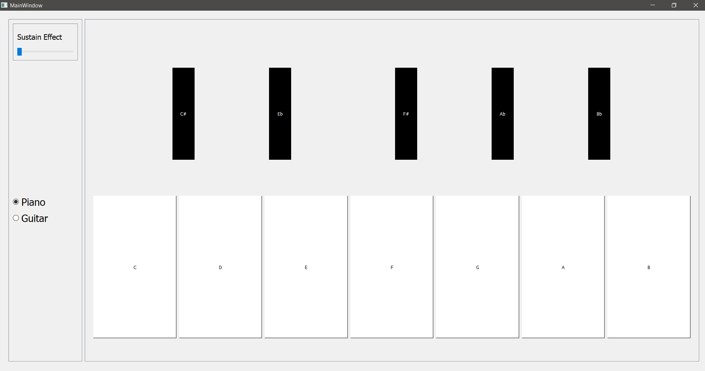

# Musical-Instruments-Modeling

Most of the musical instruments can be modelled and their sounds can be synthetically generated on your computer using a mix of some harmonic waves along with some filters according to some modeling equation (regular or differential).

we developed an app that represents two musical instruments and simulates their sounds and notes in a figure of buttons.

The app allows the user to play his/her music and also give the user some of the instrument’s basic options.

